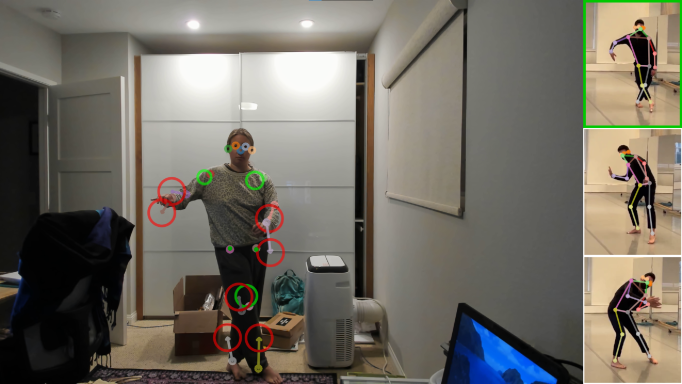

# Real-time pose matching demo

A real-time demo running on webcam feed that guides subject to move to match pre-defined target poses.



*Move your body to match each of the target poses on the right!*

## Setup
```
conda env create -f environment.yml -n movenet-dance-demo
conda activate movenet-dance-demo
```

To change the target poses, see the notebook: [`make_target_poses.ipynb`](make_target_poses.ipynb)

For an example of standalone inference, see the notebook: [`inference_demo.ipynb`](inference_demo.ipynb)


## Usage
To run the demo:
```
python live_demo.py
```

To use a different camera:
```
python live_demo.py -c 1
```

To make it easier, increase the target tolerance:
```
python live_demo.py --tolerance 0.7
```

**Hotkeys:**

<kbd>1</kbd> - <kbd>9</kbd>: Switch between target poses.

<kbd>Tab</kbd>: Cycle through target poses.

<kbd>R</kbd>: Reset completed poses.

<kbd>Q</kbd> or <kbd>Esc</kbd>: Quit the demo.


## Credits
This demo was written by [Talmo Pereira](https://talmopereira.com) at the Salk Institute for Biological Studies to be presented at the [SICB 2022 Annual Meeting](http://burkclients.com/sicb/meetings/2022/site/workshops.html).

This code uses [MoveNet](https://blog.tensorflow.org/2021/05/next-generation-pose-detection-with-movenet-and-tensorflowjs.html) for pose estimation by Ronny Votel, Na Li and other contributors at Google.

The target pose data is courtesy of the [danceTactics](http://www.dancetactics.org/about) crew directed by [Keith A. Thompson](https://musicdancetheatre.asu.edu/profile/keith-thompson) at Arizona State University.
